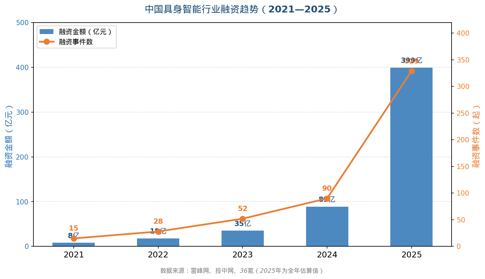
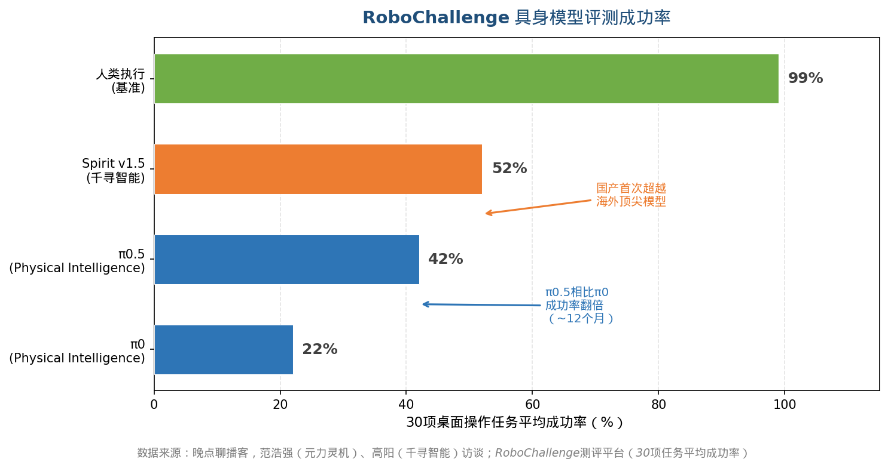
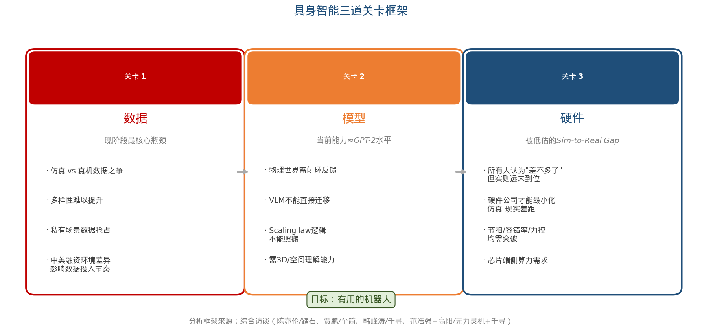
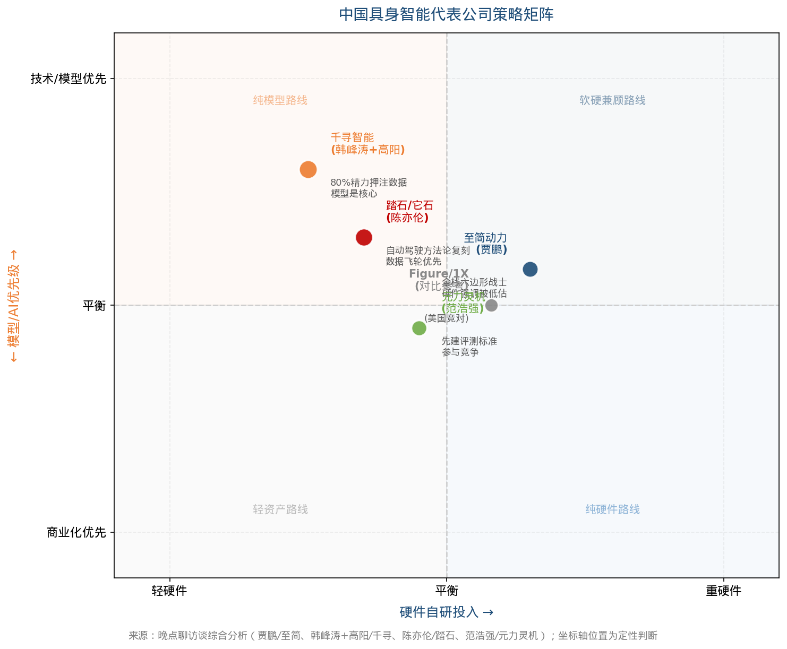

# 用多支小宇宙播客做行研 Skill

**把相关话题、类似行业的多个播客音频链接，变成一份有深度的行业分析报告。**

单一访谈容易形成片面视角。这个 skill 的价值在于：把同一行业中不同背景、不同立场的人说的话放在一起，找到共识、分歧和盲点，生成一份比任何单篇访谈都更有深度的行业洞察。

---

## 案例：中国具身智能行业深度研究

> 输入：4 期晚点聊播客（至简动力、千寻智能、元力灵机、踏石·它石智行）
> 输出：[具身智能行业深度研究报告.docx](examples/具身智能行业深度研究报告.docx)

### 报告图表预览

**行业融资趋势（2021–2025）**



**RoboChallenge 主流模型任务成功率对比**



**具身智能三道关卡框架**（数据 → 模型 → 硬件）



**中国具身智能代表公司策略矩阵**



---

## 功能

- **音频转录**：输入小宇宙节目链接，自动下载音频、切分长录音（>25分钟）、调用千问 `qwen-audio-turbo` 逐段转录，保存逐字稿 `.txt` 文件
- **多源综合**：将 2–N 个访谈逐字稿合并分析，提炼共识与分歧
- **行业报告**：生成结构化 `.docx` 报告，含图表、来源标注、核心问题框架
- **混合输入**：可同时接受小宇宙链接 + 已有逐字稿文件

## 两步流水线

```
小宇宙链接 x N
     ↓
[Step 0] 转录 → episode_title.txt（交付物）
     ↓
[Step 1–6] 综合分析 → 行业报告.docx（交付物）
```

也可以跳过 Step 0，直接传入已有的逐字稿文件。

---

## 使用方法

### 前置条件

- [Claude Desktop](https://claude.ai/download) + Cowork 功能
- 阿里云 DashScope API Key（用于千问音频转录）：[申请地址](https://dashscope.console.aliyun.com/)

### 安装

1. 下载 [`podcast-synthesis.skill`](./podcast-synthesis.skill)
2. 在 Claude Desktop 中，点击 **"Copy to your skills"**
3. 完成安装

### 触发方式

直接告诉 Claude：

```
我有几期小宇宙播客的链接，都是关于 [行业] 的创业访谈，
帮我转录并综合分析。

链接：
https://www.xiaoyuzhou.fm/episode/xxx
https://www.xiaoyuzhou.fm/episode/yyy

千问 API Key: sk-xxx
```

或者上传已有逐字稿文件：

```
我上传了 3 个播客访谈的逐字稿，帮我整合成一份行业分析报告。
```

---

## 文件结构

```
skill/
├── SKILL.md              # Skill 主体：工作流、规则、报告模板
└── scripts/
    └── transcribe.py     # 小宇宙音频转录脚本（CLI 工具）

examples/
├── 具身智能行业深度研究报告.docx   # 示例输出报告
├── 01_funding_trend.png
├── 02_scurve.png
├── 04_three_gates.png
└── 05_strategy_matrix.png

evals.json                # 5 个测试用例
podcast-synthesis.skill   # 可一键安装的 Claude skill 包
```

## 单独使用转录脚本

`scripts/transcribe.py` 也可以单独作为命令行工具使用：

```bash
python scripts/transcribe.py \
  "https://www.xiaoyuzhou.fm/episode/xxx" \
  "https://www.xiaoyuzhou.fm/episode/yyy" \
  --api-key sk-你的千问key \
  --output-dir ./transcripts
```

**依赖**：Python 3.12+（标准库）、`ffmpeg`（系统级安装）。无需 pip install。

---

## 报告结构

生成的 `.docx` 报告包含：

1. 执行摘要
2. 核心问题框架
3. 行业现状定位（技术 S 曲线）
4. 分析主体（各维度跨访谈对比）
5. 共识与分歧矩阵
6. 结论与推断
7. 附录（来源说明）

**来源标注规则**：
- `[访谈]` — 受访者直接说的
- `[来源: XXX]` — 第三方数据，标注出处
- `[研究推断]` — 基于访谈内容的推断，非事实

---

## License

MIT
